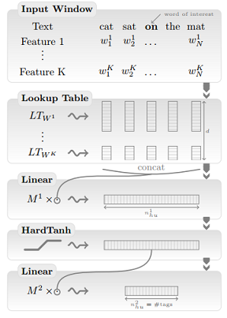

# Chinese Temporal Expression Extraction

Xi Zhang  
Feb. 2018

## 1. Domain Background
T-IR (Temporal Information Retrieval) is critical for many applications, such as deaing with queries like "
Remind me to buy tickets at 9 o'clock tomorrow". [1] is a survey for T-IR problem, it divides T-IR into 2 steps：TimEx (Temporal Expression) Extraction and Normalization.TimEx extraction finds the words in a sentence that constitue a temporal expression, and normalization analyzes what is the specific time that the timex refer to. Both rule-based methods and machine learning methods are applied is solving TimEx extraction, but to the best of my knowledge, only rule-based methods ars used in TimEx normalization.

TempEval contests focused on temporal and event information retrieval, and TimEx extraction is a subproblem of them. TempEval-2 provided corpus for 6 languages including Chinese, but among the submitted systems, no one dealed with Chinese corpus. TempEval-3 provided English and Spanish corpus, and both the scale and quality is better than TempEval-2. In TempEval-3 T-IR subtask, the performance of rule-based methods and machine learning based methods are close[2]. SUTime[3] and HeidelTime[4] are rule based system, whose F-score are both about 90.3%. ClearTK-TIME[5] and ManTIME[6] are machine learning based system, the F-score of the former is 90.2%, the latter 88.1%.

[7] and [8] deals with Chinese corpus. [7] also based on HeidelTime system, developed rules for Chinese, and achieves 89.3% F-score. [8] achieves 84.7% F-score with CRF (conditional random field) method.

All the work mentioned above models TimEx extraction as a BOI (Inside–outside–beginning) tagging probem. In recent years, neural network and deep learning also get good performance in NLP tagging problem. [9] introduced an neural network methods for POS tagging. And it's supposed that this method can also apply to TimEx extraction.

This capstone project will focus on TimEx extraction for Chinese corpus.

## 2. Problem Statement
TimeML[10] is a markup language for temporal and event expressions for natural language. And the TIMEX3 specification of TimeML is used for temporal expression. It defines TimEx as a phrase composed of on or many time expression unit, and classify the expressions into four types：Data, Time, Duration and Set. For TimEx extraction, we only need to find which words in the sentence constitute a TimEx. In Chinese language, sentence are composed of words, so with BOI tagging model, we can tag the begin word of a TimEx as 'B', the other words in this TimEx as 'I', and all the words that are not in any TimEx as 'O'. An example:  
> "今年/B 6月/I , /O 公司/O 发布/O 声明/O , /O 要/O 在/O 8月/B 推进/O 这项/O 计划/O ./O".  

## 3. Datasets and Inputs
The TIMEX tagged Chinese corpus are very rare, TempEval-2 corpus and ACE2005 corpus are the only known corpus to my knowledge. And unfortunately, ACE2005 corpus can't be accessed for free, so in this project, I will only use [TempEval-2 Corpus](http://semeval2.fbk.eu/semeval2.php?location=data) for training and evaluation. In this corpus, there 44 documents, 931 sentences,23180 words and 763 TimEx in the training set. And there are 8 documents, 195 sentences, 5313 words and 131 TimEx in the testing set.

Besides, some unsupervised learning methods such as word2vec can be trained with unannotated corpus. In this project, [1998 People Daily Corpus](http://www.icl.pku.edu.cn/icl_res) will be used.

## 4. Solution Statement
Many algorithms can be applied in sequece tagging probem, such as HMM and maximum entropy, et al. In this project, I will try 2 methods:
1. CRF based tagging
2. word embedding and neural network based tagging

## 5. Evaluation Metrics
I used the same metric as TempEval-2, evaluating the precison, recall and F-score of a system. First count the number of true positives (tp), true negatives (tn), false positives (fp) and false negatives (fn) on a token by token basis. E.g. if "明天 早上" is a TimEx, but only "明天" is recogized as TimEx, then there will be one true positive and one false negative.

The statistics calculation are:
```
precision = tp / (tp + fp)
recall = tp / (tp + fn)
f1-measure = 2 * (precision * recall) / (precision + recall)
```

## 6. Benchmark Model
First, a CRF-based tagger is implemented, which only use a small number of feature template. The precision, recall and F-score of this tagger is 82.5%, 92.8% and 74.3%.
> Feature template：  
> 1. current word
> 2. last word or BOS (begin of sentence)
> 3. next word or EOS (end of sentence)
> 4. last character of the current word
> 5. first character of the current word

Besides, the performance of the system mentioned in the backgroup section is also shown in the table below.

ID | System | Method | Language | F-score | Precision | Recall
---|---|---|---|---|---|---
1 | SUTime | rule-based | English | 90.32% | 89.36% | 91.30 
2 | HeidelTime | rule-based | English | 90.30% | 93.08% | 87.67
3 | ClearTK | machine learnin | English | 90.23% | 93.75% |86.96
4 | ManTIME | machine learnin | English | 89.66% | 95.12% | 84.78
5 | HeidelTime | rule-based | Chinese | 95.5% | 83.8% | 89.3%
6 | POS-R[8] | machine learnin | Chinese | 84.17% | 85.16% | 83.21%
7 | Benchmard model | machine learnin | Chinese | 82.5% | 92.8% | 74.3%


## 7. Project Design

### 7.1 CRF-based tagging
[1] provides a workflow for TimEx extraction, shown in the next figure, which consitutes of preprocessing and extraction.


The preprocessing step includes：
1. word segmentation
2. POS tagging
3. NER recoginition

As the corpus of TempEval-2 is already segmented, so step-1 is not needed. And to some extent, NER-Recoginition overlap with TimEx extraction, so step-3 is also ignored.

As for extraction, I will first prepare a number of syntactic, semantic of POS-based feature template manually, and then train the CRF model with the dataset.

### 7.2 Word embedding and neural network based tagging
Word embedding is a representation for words in natural language. And it is a real number array with low dimension (usually 50 or 100).[9] introduced a pos tagging methods based on word embedding and neural network. The structure of the network is shown in the figure below.



There are three layers in this network: linear layer, HardTanh layer and output layer. But before training, one must decide what is the input for this network. [9] first transforms each word into a word embedding with a pre-trained lookup table, then combied with the encoding of other features, such as pos tagging, forms a real number vector to be the input. Here, we can pretrain the word embedding with 1998-PeopleDaily corpus. Another point to note is, sentences are of variant length, how can deal with them with neural network? [9] introduced a windows-based method to solve this. This method assumes that the tag of a word is only related to its neighbors, so it defines a fix-length window, only the neighbors in this window will be used to predict the tag of the current word. So in this way, the dimension of the input will be fixed.

In this project, I will try to tag the TimEx in a similar way.

## 8. Appendix
The corpus to be used:
1. [TempEval-2 Corpus](http://semeval2.fbk.eu/semeval2.php?location=data)
2. [1998 people daily](http://www.icl.pku.edu.cn/icl_res)
    > If this webset is not accessible, please refer to http://www.cnblogs.com/eaglet/archive/2007/09/10/888377.html

The softwares that are expected to use in my capstone project:
1. [Stanford POS Tagger](https://nlp.stanford.edu/software/tagger.shtml)
2. [pycrfsuite](https://pypi.python.org/pypi/python-crfsuite)
3. [gensim](https://radimrehurek.com/gensim/models/word2vec.html)
4. [tensorflow](https://www.tensorflow.org/)

## 9. Reference
[1] Campos R, Jatowt A. Survey of Temporal Information Retrieval and Related Applications[J]. Acm Computing Surveys, 2015, 47(2):15.  
[2] Naushad UzZaman, Hector Llorens, Leon Derczynski, James Allen, Marc Verhagen, and James Pustejovsky. 2013. SemEval-2013 Task 1: TempEval-3: Evaluating Time Expressions, Events, and Temporal Relations. In Second Joint Conference on Lexical and Computational
Semantics (*SEM), Volume 2: Proceedings of the Seventh International Workshop on Semantic Evaluation (SemEval 2013), pages 1–9, Atlanta, Georgia, USA,June.  
[3] Angel X Chang and Christopher Manning. 2012. Sutime: A library for recognizing and normalizing time expressions. In Proceedings of the 8th International Conference on language Resources and Evaluation  
[4] Giulio Manfredi, Jannik Strotgen, Julian Zell, and ¨ Michael Gertz. 2014. HeidelTime at EVENTI: Tuning Italian Resources and Addressing TimeML’s Empty Tags. In Proceedings of the Forth International Workshop EVALITA, pages 39–43.  
[5] Bethard Steven. Cleartktimeml: A minimalist approach to tempeval 2013. Second Joint Conference on Lexical and Computational Semantics (*SEM), Volume 2: Proceedings of the Seventh International Workshop on Semantic Evaluation (SemEval 2013); Atlanta, Georgia, USA. June; Association for Computational Linguistics; 2013. pp. 10–14.  
[6] Michele Filannino, Gavin Brown, and Goran Nenadic. 2013. Mantime: Temporal expression identification and normalization in the tempeval-3 challenge. In Second Joint Conference on Lexical and Computational Semantics.  
[7] Hui Li, Jannik Strotgen, Julian Zell, and Michael Gertz. 2014. Chinese Temporal Tagging with HeidelTime. In Proceedings of the 14th Conference of the European Chapter of the Association for Computational Linguistics (EACL ’14), pages 133–137. ACL.  
[8] Junchan Li; Recognition of Temporal，Event Expressions and Their Attributes in Chinese Texts[D]; Shanxi Universit; 2013  
[9] 179. R. Collobert J. Weston L. Bottou M. Karlen K. Kavukcuoglu P. Kuksa "Natural Language Processing (almost) from Scratch" J.Machine Learning Research vol. 12 pp. 2493-2537 2011.   
[10] Roser Saur´ı, Jessica Littman, et al. TimeML Annotation Guidelines Version 1.2.1 https://catalog.ldc.upenn.edu/docs/LDC2006T08/timeml_annguide_1.2.1.pdf
