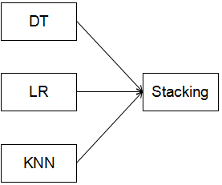

# 语音性别识别开题报告

张曦  
2018年4月

## 1. 项目背景
语音识别技术可在许多场景提升人机交互的效果，如航天驾驶、机器人看护等等。性别识别，作为语音识别算法中的一环，可以有效降低后续步骤的复杂度[1]。基音频率是性别识别中一个重要的判别依据，反映了说话人发浊音时的声带振动频率[2]，男性较女性频率值更低。

## 2. 问题描述
本项目中，提供了3168个样本，其中50%为男性，50%为女性。且数据集中已提供了从音频中抽取的特征，包含频率平均值、频率标准差等共计22个，因此该问题可看成是一个二元分类问题。

## 3. 输入数据
数据集由项目直接提供。

## 4. 解决办法及评估指标
很多机器学习的模型都可适用于该问题，如逻辑回归、决策树、随机森林、支持向量机、神经网络、XGBoost等等。可采用准确率作为评估指标。

## 5. 基准模型
在Kaggle上，Niraj Verma上传了一个kernel[3]，使用SVM模型来解决该问题。Niraj尝试使用了线性核、rbf核、多项式核，使用K-fold交叉验证，并通过调节超参数，最终在验证集上取得0.958的准确率。

## 6. 设计大纲
为解决该问题，将尝试使用不同的模型，包含决策树、逻辑回归、最近邻等，然后再使用stacking方法，把不同模型的结果融合起来，形成最终的预测。  

## 7. 参考文献
[1] Anjali Pahwa, Gaurav Aggarwal. Speech Feature Extraction for Gender Recognition.  
[2] 张超琼, 苗夺谦, 岳晓冬. 基于高斯混合模型的语音性别识别[J]. 计算机应用, 2008, 28(S2):360-362.  
[3] https://www.kaggle.com/nirajvermafcb/support-vector-machine-detail-analysis?scriptVersionId=940166  
